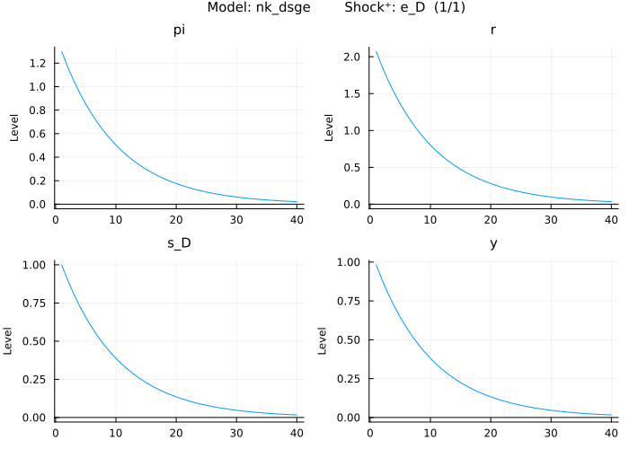
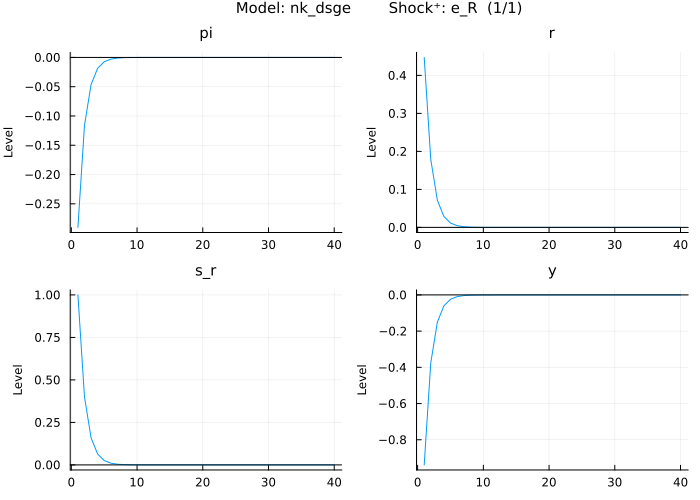

# The Analytics of the New Keynesian 3-Equation Model

This repository replicates the core results of the paper:

**"The Analytics of the New Keynesian 3-Equation Model"**  
Jean-Christophe Poutineau, Karolina Sobczak, Gauthier Vermandel  
_Economics and Business Review_, Vol. 1 (15), No. 2, 2015, pp. 110–129  
Originally published by the University of Poznan.

---

## 📌 Purpose

This project provides a Julia-based replication of the canonical New Keynesian 3-equation model using:

- [`MacroModelling.jl`](https://github.com/IMFS-MMB/MacroModelling.jl) – for solving DSGE models
- [`StatsPlots.jl`](https://github.com/JuliaPlots/StatsPlots.jl) – for visualizing impulse response functions and results

The original Dynare/MATLAB code is translated into idiomatic Julia code using modern macroeconomic modeling tools.  
It is particularly suited for students, researchers, and instructors seeking transparent and reproducible macroeconomic model implementations.

---

## ⚙️ Model Implementation in Julia

### 1. Model Equations

```julia
@model nk_dsge begin
    # IS curve
    y[0]   = y[1] - (1/σ) * (r[0] - pi[1]) + s_D[0]

    # Phillips curve
    pi[0]  = β*pi[1] + ((1-θ)*(1-β*θ)/θ)*(σ+φ)*y[0] + s_S[0]

    # Taylor rule
    r[0]   = ρ*r[-1] + (1-ρ)*(φ_π*pi[0] + φ_y*y[0]) + s_r[0]

    # Shock processes
    s_D[0] = ρ_D*s_D[-1] + e_D[x]
    s_S[0] = ρ_S*s_S[-1] + e_S[x]
    s_r[0] = ρ_R*s_r[-1] + e_R[x]
end
```

### 2. Calibration Parameters 

```julia
@parameters nk_dsge begin
    β      = 0.99
    σ      = 1.0
    φ      = 1.0
    θ      = 3/4
    ε      = 6.0
    ρ      = 0.0
    φ_π    = 1.5
    φ_y    = 0.5/4
    ρ_D    = 0.9
    ρ_S    = 0.9
    ρ_R    = 0.4
end
```
### 3. Plot and Simulate Shocks 
```julia
plot_irf(nk_dsge)
```

### Demand Shock


A 1% positive demand shock raises output and inflation, prompting the central bank to increase interest rates. The economy gradually returns to equilibrium depending on policy response strength.

### Supply Shock


A 1% rise in inflation from a supply shock raises interest rates and reduces output. Over time, inflation and the output gap return to their steady-state values, influenced by policy parameters.

### Policy Shock


A 1% increase in the nominal interest rate leads to a fall in demand, output, and inflation. The economy recovers over time as policy adjusts according to the Taylor rule.

